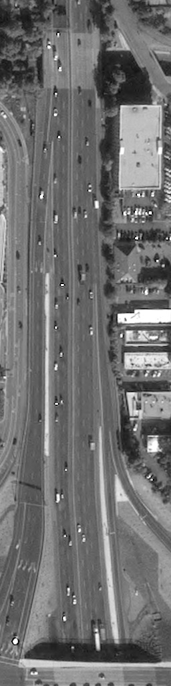
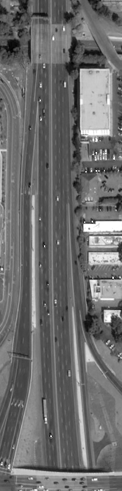
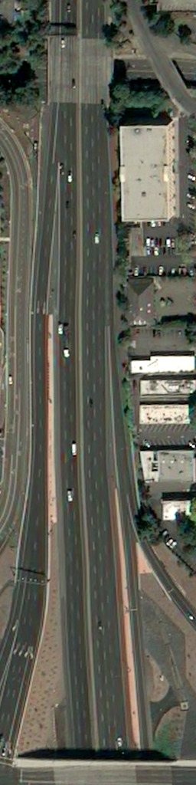

# How’s my Quarantine?

 
Options for measuring quarantine effectiveness
----------------------------------------------

Disclaimer
----------

The authors of this analysis and corresponding tools are not epidemiologists or doctors of any sort. Therefore, we make every attempt to avoid prediction. Instead, the purpose of this work is to provide accessible measurements of quarantine effectiveness in local populations. This can help people discover and understand which local areas are social distancing more effectively.

Overview
--------

While people around the world are implementing social distancing measures, we wonder about the effectiveness of these sacrifices in combating the global COVID-19 pandemic. Without being experts in epidemiology, we wanted to at least contribute some useful tools and techniques in collecting and analyzing data sources to show signs of effectiveness. In this way, people have some feedback about the extent of behavior changes in a specific area.<br><br>
	To better understand the context of these social distancing measures, we examine published models and tools. One of the useful tools we used is the [Epidemic Calculator](http://gabgoh.github.io/COVID/index.html), which is based on the [SEIR model](http://www.public.asu.edu/~hnesse/classes/seir.html). However, as we will show from our data, critical parameters (especially those based on human behavior, which we focus on) change frequently, and there is no easy way to incorporate a series of such parameters instead of a single constant using this tool. There are [other models](https://www.ncbi.nlm.nih.gov/pmc/articles/PMC6002118/) and complex interactions between territories that are hard to include into an accurate model. When different local areas start a quarantine at different times or represent different communities and ecosystems, they should be modeled separately. Additionally, modeling accuracy is sensitive to a very [low number of initial infections](https://jamanetwork.com/journals/jama/fullarticle/2762130). <br><br>
 A key factor in modeling is the [Basic Reproduction Number](https://wwwnc.cdc.gov/eid/article/25/1/17-1901_article#r10) (R0), which essentially captures the speed of propagation. This includes two components, the inherent aggressiveness of the disease, and the behavior of people that leads to human-to-human spread. One of the assumptions for this modeling is that COVID-19 does not change its intrinsic aggressiveness, but we can change the behavior of humans. This gives a second Reproduction Number, after social distancing is in effect (Rt). Our goal is to find accessible measures that indicate change in human behavior specific to a given area and feed these inputs to modeling. Other parameters for modeling can be found in other sources such as CDC, WHO, or publications from the research community. Also since the expected relationships between published data are known, we can derive some inputs based on statistics that are easier to measure such as the number of hospitalized cases or deaths. In other cases, the relationships between parameters could propagate or increase measurement errors. In general, though, we expect higher confidence when multiple methods converge to a similar result. Therefore, alternative methods like [measuring Rt](https://rt.live/) [based on the number of new cases per day](https://github.com/k-sys/covid-19/blob/master/Realtime%20R0.ipynb), can be compared to see the relative impact of testing-related inaccuracies such as test availability, supply chain complexity, and testing procedures against traffic counting inaccuracies from the method we describe.

Methodology and Limitations
---------------------------

In addition to the Basic Reproduction Number (R0), the model will make use of an estimate of initial infections. This estimate can be obtained either from a [real number of cases](https://coronavirus.1point3acres.com/) [\[2\]](https://covid19.healthdata.org/united-states-of-america) [\[3\]](http://www.khuang.io/covidtracker/) [\[4\]](https://www.worldometers.info/coronavirus/#countries) or [retrospectively estimated based on the number of deaths](http://www.uni-goettingen.de/de/document/download/ff656163edb6e674fdbf1642416a3fa1.pdf/Bommer%20&%20Vollmer%20(2020)%20COVID-19%20detection%20April%202nd.pdf).  Since other work usually includes useful options for R0, we focus on estimating the impact of social distancing changes. 
<p> Many data sources can be used to measure the human behavior changes related to social distancing. However, most of this data is not available due to privacy concerns (eg. GPS data from cell phones). Other data sources, like the number of cars on a public street are readily accessible for purposes like measuring traffic for the daily commute. We will consider this an approximation of contact outside of a family circle. In this way, we can compare cars on the road before and during imposing social distancing measures. </p>	
<p> As an example, the following  data sources might prove useful to measure the effect of distancing:

* Traffic/weather cameras, and/or counters (such as live cameras from state departments of transportation, parks, tourism centers, or https://www.weatherbug.com/traffic-cam/) 
* Cars or foot traffic in public areas (parks, beaches, etc)
* Average traffic in stores per day
* Tools like [placemeter.com](http://www.placemeter.com/)
* Anonymous analysis of security camera footage (in stores, public transit, or other places)
* Analysis based on mobile phones/apps (such as [analysis released by Google](https://www.google.com/covid19/mobility/))

<p>	One of the options for data collection  we found was UP42 - https://up42.com/ - a platform to retrieve satellite images and run analysis on them. This allows easy access to images of roads before and during social distancing, and it can automatically identify the number of cars. This can also be used to detect cars in parking lots near stores, beaches, office buildings, or other places of interest. This gives us a measurable difference in how many contacts people have in a specific area. The process can be repeated over many roads and multiple different times in a given area in order to refine the estimate. The result can then be used to set parameters in the pandemic modeling that correspond to actual observations for the local area. </p>
<p>	Taken together, this helps us to understand:

* Potential propagation within a smaller area (county, state, locality) (R0->Rt)
* Why we need to quarantine and for how long (R0->Rt)
* How well and how fast these measures help to fight the epidemic (Rt)
* How effectively are people actually following social distancing within a specific area (Rt for specific county, area, state) and how it would likely affect the overall epidemic. 

<p>	While this should be a useful estimation tool, there are some notable limitations to consider. We will note these limitations along with some mitigation measures below:

* We must compare similar situations when considering the date and time of the satellite images. For example, we should compare similar working hours, morning or evening, and we should compare work days, weekends, and holidays separately.
* We must compare only cars in the street and ignore parking lots or nearby houses, since these may not represent people moving outside their family circle.
* To improve accuracy across an entire locality we should pick many different regions for comparison from a given area. 
* While we would ideally like to compare data every day, this is not available from the data source we found (UP42). However, we can get a rough estimate by examining a “control” date long before the social distancing measures started, using it to verify the count of vehicles right before social disting, and then comparing the vehicle count during social distancing.
* The method can have false positives (eg. driving from one place to another without contacting anyone) and false negatives (walking across the street to a neighbor’s house). However, in many regions of the United States right now, contacts outside the immediate family usually involve travel on roads using vehicles. In regions where this is not true, another metric may be needed.
* The number of cars on the street may not linearly represent the number of exposed contacts, which requires a separate study. To simplify this analysis, however, we assumed it to be linear. After performing this analysis across many areas and checking the historical data, we may be able to estimate a better fit for this relationship. For example, a future study might compare the actual death rate in densely populated areas vs sparse areas and control that they have similar traffic reduction.
* For certain localities, where people do not frequently use vehicles, this specific technique of measuring vehicles will not apply.  In particular, most cities will have heavier foot or railway transit. 
* The UP42 system seems to have a weak confidence level for vehicle detection in many cases, and this can likely be improved. 
* While we assumed a linear impact on Rt, we expect increased accuracy by assigning [different weights to the impact on Rt](https://www.centerforhealthsecurity.org/our-work/pubs_archive/pubs-pdfs/2020/reopening-guidance-governors.pdf) from [measurements in different locations](https://www.aei.org/research-products/report/national-coronavirus-response-a-road-map-to-reopening/). 
Rt = Rretail * Wretail + Rgrocery * Wgrocery + Rrecreation* Wrecreation + Rtransit * Wtransit + Rworkplace * Wworkplace

Getting Started (Example)
------------------------

As stated in the beginning, we make no conclusions based on the data and analysis below. Instead, we simply apply this technique and show its results for a single roadway. Hopefully, this is instructive in applying a similar technique across many more data points. Using UP42, we selected a small area of road in San Jose, CA 95128, between I-880 and Stevens Creek Blvd, and we collected data from 3 points of the time, corresponding to a control, a time just before social distancing, and a time during social distancing: 2019-12-10, 2020-03-12, 2020-04-01  

```
        2019-12-10                    2020-03-12                     2020-04-01 
```

    

   
Using UP42 analysis to calculate the number of cars, we observe:

```
2019-12-10 19:16:19.56Z:    91
2020-03-12 19:01:30.56Z:    96
2020-04-01 18:56:33.68Z:    36
```

To obtain this data, we used the following UP42 Configuration:
```
{
  "sm_veh-detection:1": {},
  "oneatlas-pleiades-aoiclipped:1": {
    "ids": null,
    "time": "2020-04-01T00:00:00+00:00/2020-12-20T23:59:59+00:00",
    "limit": 1,
    "intersects": {
      "type": "Polygon",
      "coordinates": [
        [
          [
            -121.941054,
            37.327035
          ],
          [
            -121.940689,
            37.326992
          ],
          [
            -121.940485,
            37.323451
          ],
          [
            -121.940893,
            37.32346
          ],
          [
            -121.941054,
            37.327035
          ]
        ]
      ]
    },
    "zoom_level": 18,
    "time_series": null,
    "max_cloud_cover": 100,
    "panchromatic_band": false
  }
}
```
There are a few cars in the parking lot on the bottom right part of the image which should be excluded for more accurate analysis, and we should collect a bigger set of data from the different intersections & highways around the same area (perhaps 20-100 different locations). However, this rough approximation shows that during social distancing, the number of cars on the street has reduced by approximately 3 times. which can be reflected in our value for Rt in the modeling for that area.  

To try this in chosen areas, select coordinates for a rectangle of road and repeat for multiple locations. After revealing consistent decrease in cars, reflect this decrease back into the input for Rt in the model.

To assist with collecting this data in an automated fashion, we have developed and released the following script: https://github.com/jagfu/Qanalysis/blob/master/pleiades_script.py


References:
-----------
1. https://coronavirus.1point3acres.com/
2. https://covid19.healthdata.org/united-states-of-america
3. http://www.khuang.io/covidtracker/
4. https://www.worldometers.info/coronavirus/#countries
5. https://www.uptodate.com/contents/coronavirus-disease-2019-covid-19
6. https://mobile.twitter.com/ODR228/status/1244000603245875202?s=20
7. https://www.cdc.gov/coronavirus/2019-ncov/hcp/clinical-guidance-management-patients.html
8. https://www.cdc.gov/mmwr/volumes/69/wr/pdfs/mm6915e3-H.pdf
9. https://www.cdc.gov/coronavirus/2019-ncov/covid-data/covidview/index.html
10. https://www.bmj.com/content/369/bmj.m1375
11. https://www.google.com/covid19/mobility/
12. https://www.medrxiv.org/content/10.1101/2020.04.14.20062463v1
13. https://www.centerforhealthsecurity.org/our-work/pubs_archive/pubs-pdfs/2020/reopening-guidance-governors.pdf
14. https://www.aei.org/research-products/report/national-coronavirus-response-a-road-map-to-reopening/
15. https://rt.live/
16. https://github.com/k-sys/covid-19/blob/master/Realtime%20R0.ipynb
17. https://modelingcovid.com/


Maybe also useful alternatives/ideas:

* https://developer.here.com/documentation/traffic/dev_guide/topics/incident-data.html
* https://developer.tomtom.com/traffic-stats/traffic-stats-apis/traffic-density
* http://www.trafficland.com/api
* http://cwwp2.dot.ca.gov/tools/cctvmobile.htm
